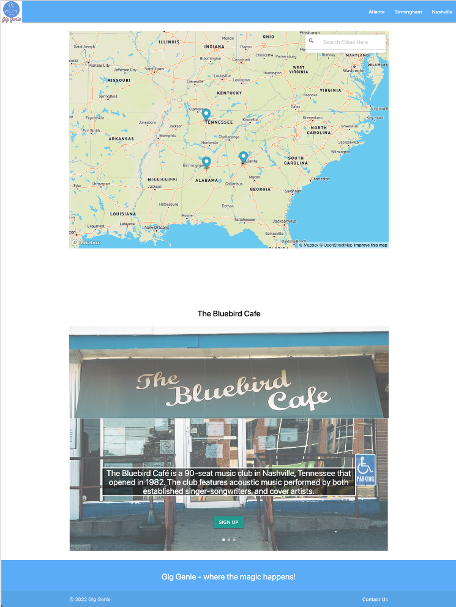

# Gig Genie

## User Story
AS AN aspiring artist  
I WANT to search and sign up for open mics / venues that have live music  
SO THAT I can expose people to my music  

## Concept
This project is <b>phase one</b> of a minimum viable product that allows users to sign up for open mics in their area. Using what we've learned in our bootcamp thus far we were able to:  
- Utilize the Mapbox API to display a map with custom markers and geolocation search capabilities
- Utilize the City of Melbourne Open Data API to retrieve live music venue data and convert that into markers on our map
- Use Materialize for overall page styling / formatting including: navbar, modals, carousel and footer
- Store form submissions from users locally

## Powered By
- HTML
- CSS
- JavaScript
- Materialize
- Mapbox
- City of Melbourne Open Data

## Future Development
- Implementing user and venue / vendor accounts, possibly even creating a social media-esque environment that allows users to "follow" other users/venues and share content
- Given more resources and time, infusing geoJSON data from a more robust API that would allow for a greater number of live music venue markers on our map
- Adding Spotify and soical media links to form submissions

## Project Members
Brennon Lent  
Marcus Carlough  
Mohamed Abdulkadir  
Tim Wardlow

## Website
https://marcusc811.github.io/Gig-Genie/
